# Rainbow Interview Challenge App Features

## Video Demonstration

- [Watch the video demonstration](https://drive.google.com/file/d/1EKIZGxgAFJ_yAyIxWXbcAr2_gMAj6aE7/view?usp=sharing)
- [V2.0 Video](https://drive.google.com/file/d/12IWNKcMtLXmpJEXnnxqnwpkQYGX5CmG-/view?usp=sharing)

## Introduction

This application is built on top of React Native using TypeScript, employing Redux Toolkit for state management, React Navigation for navigation, and Redux Persist for state persistence.

## Customized App Icon and Splash Screen Logo

- Customized app icon and splash screen logo design.

  - 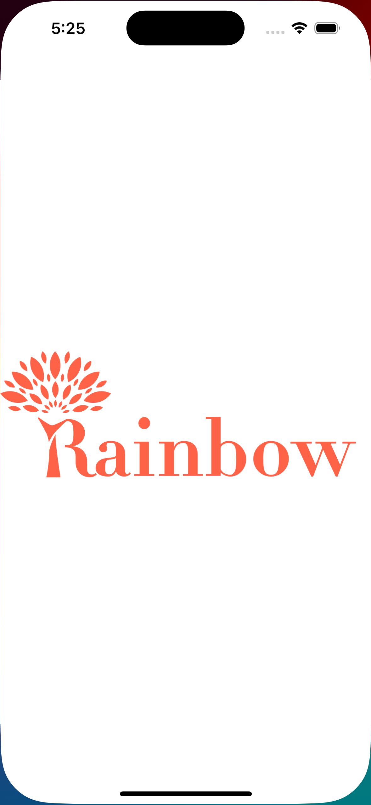

## UI/UX Inspiration from Dribbble

- User interface and user experience design inspired by Dribbble.

## Auth Screens (powered by Beecepter Mock Service):

## Key Features:

- **Efficient Navigation:** Implements a robust navigation setup adept at managing user routes, adapting dynamically based on the authentication status of the user.

- **Signup and Login:** Provides streamlined signup and login functionalities, ensuring a user-friendly experience for account creation and authentication.

- **Profile Image Management:** Users can upload an image during the signup process and update their profile picture effortlessly. This feature is powered by ByteScale Hosting, ensuring reliability and scalability.

- **Offline Persistence:** Utilizes Redux Persist to ensure user data persistence even when offline, enhancing the reliability of the application.

- **Secure Authentication:** Implements a robust authentication server and logic, ensuring the security of user credentials and sensitive data.

### Screenshots

<div style="display: flex; flex-wrap: wrap; justify-content: center;">
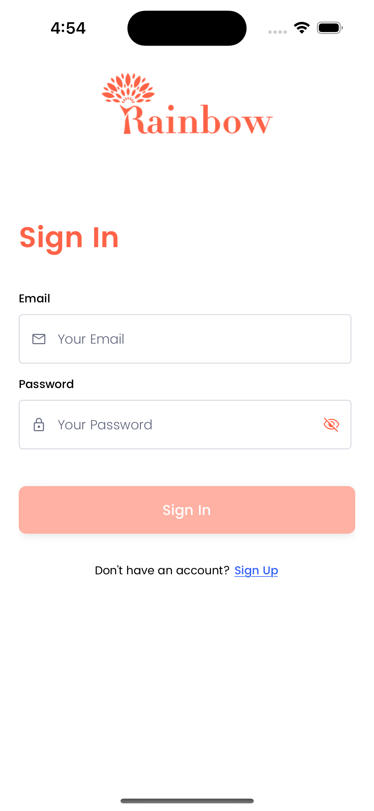
<br>
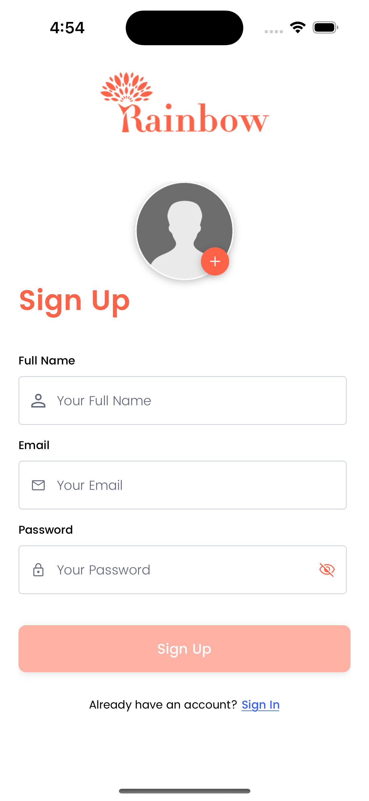
<br>
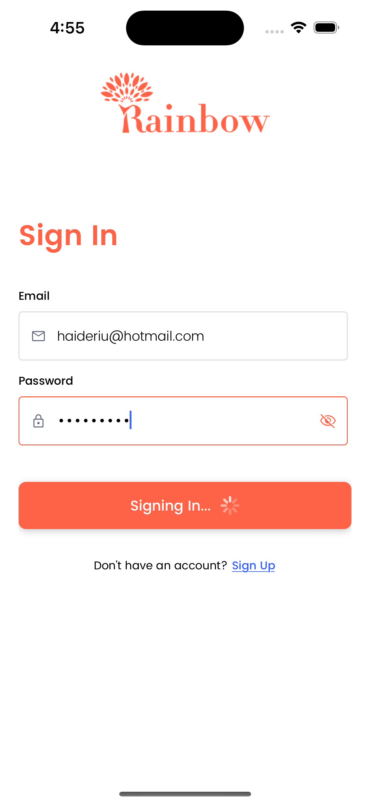
</div>

## Product Screen (Powered by DummyJson Rest API Service)

This section outlines the comprehensive features of the product listing page UI/UX designed to enhance user engagement and streamline product discovery. Leveraging Interactive Designs, these features ensure a dynamic and intuitive browsing experience for your users.

## Key Features:

- **Interactive UI/UX Design:** Engaging design elements enhance user experience, facilitating seamless navigation and intuitive interaction with product listings.

- **Category-based Sorting:** Enables users to sort products by different categories, providing flexibility and convenience in browsing.

- **Pagination with Skeleton Loading:** Implements proper pagination support with skeleton loading, ensuring smooth transitions and enhancing the perceived performance of the application.

- **Search Functionality:** Empowers users to search for products by name, facilitating quick and efficient product discovery.

- **Cart Management:** Users can easily add or remove items from their cart, streamlining the shopping experience and enhancing user satisfaction.

- **Pull-to-Refresh and Pagination:** Incorporates pull-to-refresh functionality for refreshing product listings and seamless pagination for browsing through extensive product catalogs.

### Screenshots

<div style="display: flex; flex-wrap: wrap; justify-content: center;">
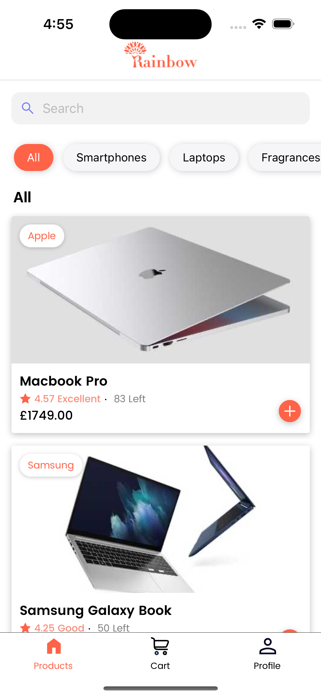
  <br>
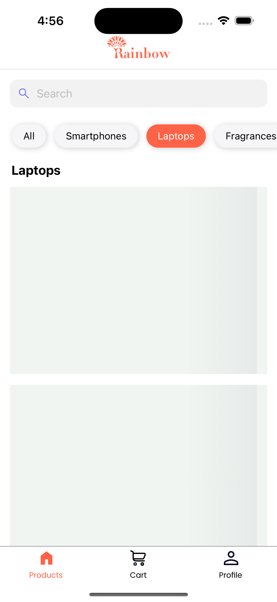
  <br>
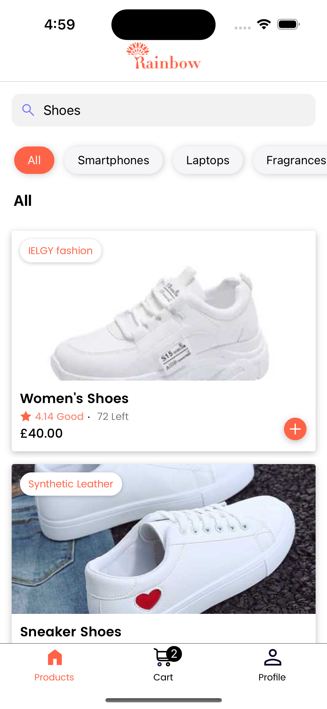
  <br>
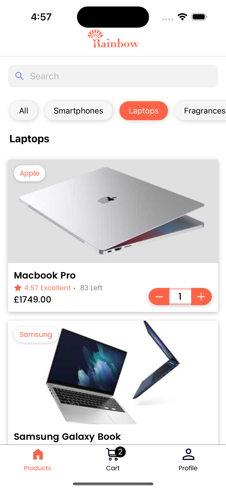
  <br>
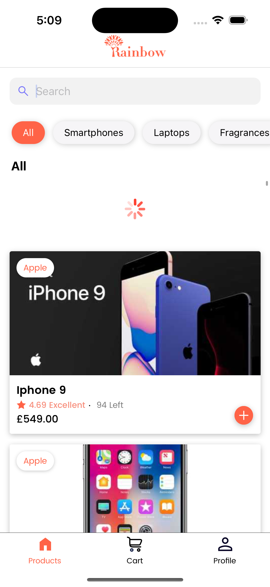
  <br>
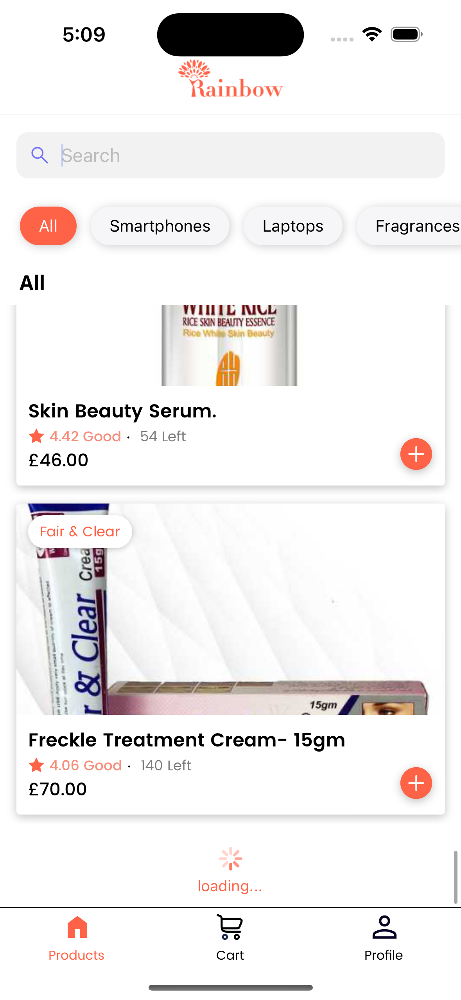
</div>

## Product Details Screen

This section describes the Product Details Screen, providing users with comprehensive information about a specific product and enabling seamless interactions.

### Key Features:

- **Detailed Product Information:** Presents detailed information about the selected product, including description, specifications, and pricing, ensuring users have all the necessary details to make informed decisions.

- **Add to Cart Option:** Allows users to easily add the product to their cart directly from the details screen, streamlining the purchasing process and enhancing user convenience.

### Screenshot

- 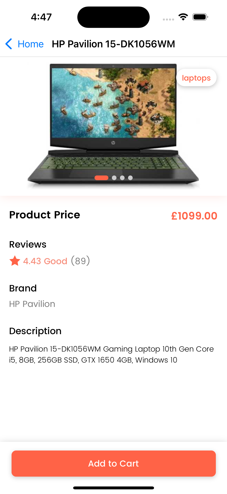

## Cart Screen (Powered by Beecepter Rest API service):

This section outlines the features of the Cart Screen, leveraging the Beecepter Rest API service to provide users with seamless shopping functionality and management of their cart items.

### Key Features:

- **View Cart Items:** Enables users to view all items added to their cart, providing a comprehensive overview of their shopping selections.

- **Add/Remove Items:** Allows users to easily add or remove items from their cart, providing flexibility and control over their shopping experience.

- **Manage Item Quantity:** Offers functionality to adjust the quantity of individual items within the cart, allowing users to fine-tune their purchase quantities as needed.

- **Total Calculation:** Automatically calculates and displays the total cost of all items in the cart, giving users clear insight into their shopping expenses.

- **Checkout and Order Placement:** Facilitates the checkout process, allowing users to proceed with order placement seamlessly. Orders are stored at Beecepter using a customized JSON format, ensuring efficient order management.

- **Cart Persistence:** Ensures cart persistence even after the app is closed, preserving users' shopping selections across sessions for a seamless experience.

- **Checkout Popup and Order Placement Loader:** Enhances the checkout experience with a popup for order confirmation and a loader to indicate the processing of the order placement, providing users with clear feedback on their actions.

### Screenshots

<div style="display: flex; flex-wrap: wrap; justify-content: center;">
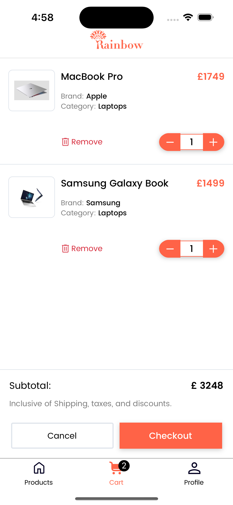
  <br>
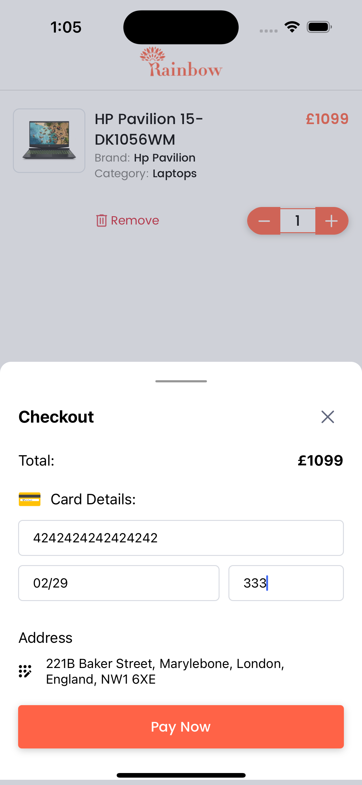
  <br>
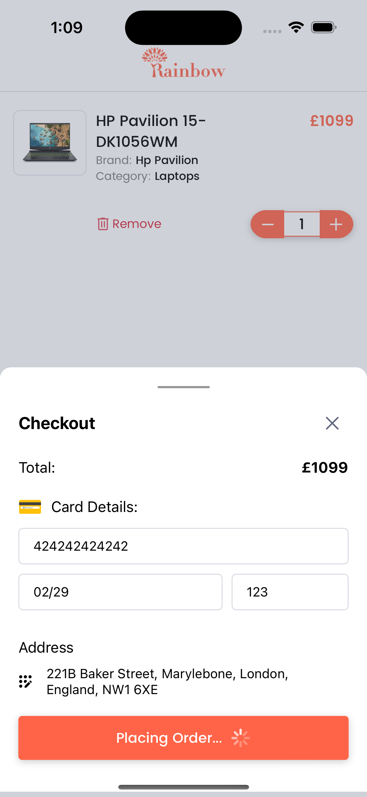
  <br>
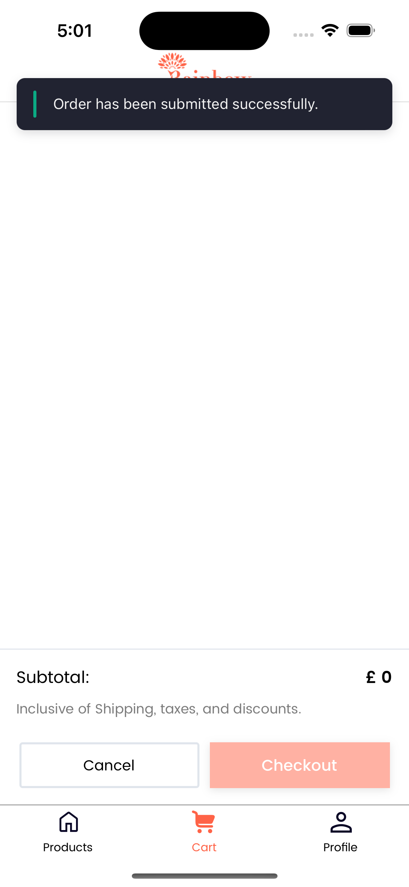
</div>

## Update Profile Screen

This section outlines the features of the Update Profile Screen, providing users with the capability to manage their profile information effectively.

### Key Features:

- **Update Full Name, Profile Image, and Password:** Allows users to modify their full name, profile image, and password, providing flexibility and control over their profile information.

- **Profile Update Functionality:** Empowers users to make changes to their profile information seamlessly, ensuring that their account details remain accurate and up-to-date.

- **Logout Option:** Provides users with the ability to log out from the application, enhancing security and offering a convenient way to end their session.

### Screenshots

<div style="display: flex; flex-wrap: wrap; justify-content: center;">

  <br>
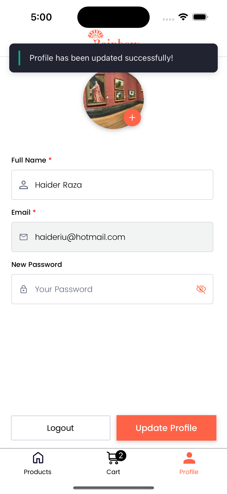
</div>

## Atomic Design Pattern

I decided to implement the atomic design pattern in this project because it offers several advantages in terms of scalability, maintainability, and reusability. Essentially, atomic design involves breaking down UI components into smaller, reusable elements such as atoms, molecules, organisms, templates, and pages. This approach promotes consistency and modular development, which makes it easier to manage and scale projects over time.

### Design Inspiration

- Most of the Design inspiration taken from Dribbble.
- Products page UI is based on the provided screenshot.

  - 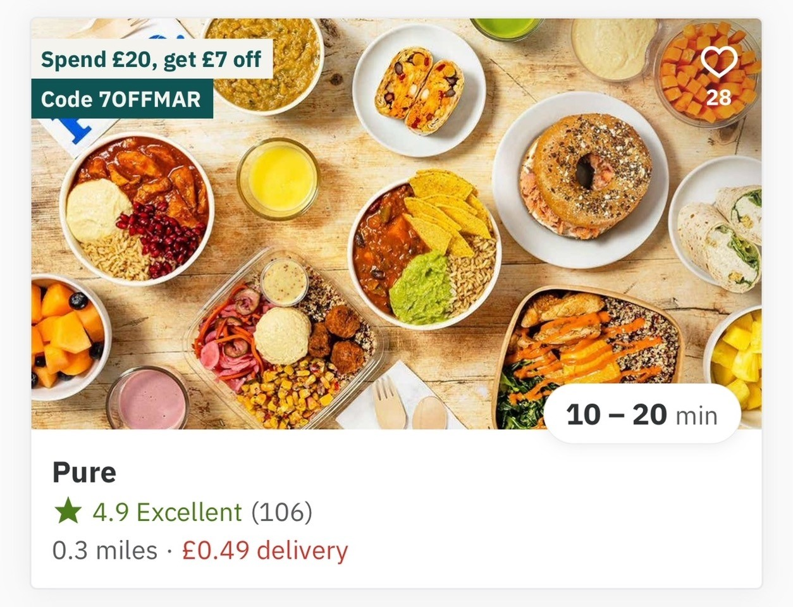

- I had almost finished designing a similar UI for the product display. However, I had to modify it to fit the available data through API.

  - 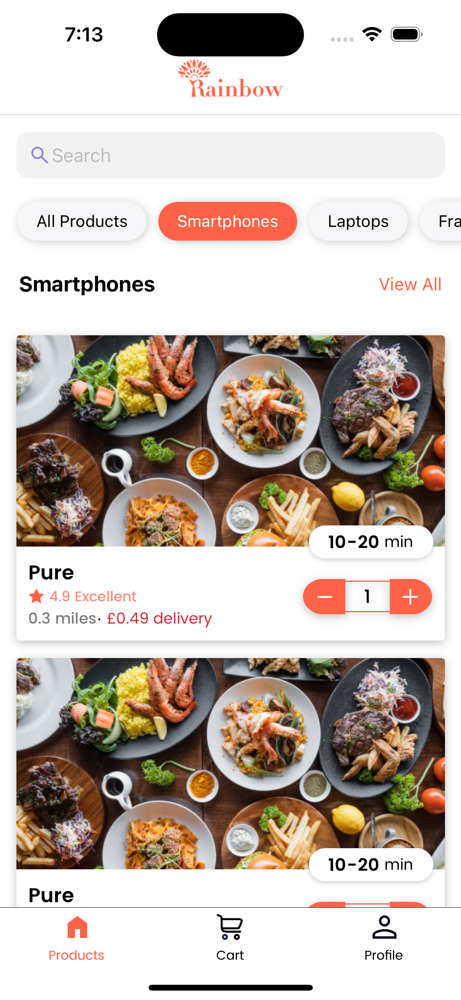

### Environment File

Please make sure to add an `.env` file in the root folder of the project. This file should contain necessary environment variables, particularly for APIs to function properly.

# Getting Started

> **Note**: Make sure you have completed the [React Native - Environment Setup](https://reactnative.dev/docs/environment-setup) instructions till "Creating a new application" step, before proceeding.

## Step 1: Start the Metro Server

First, you will need to start **Metro**, the JavaScript _bundler_ that ships _with_ React Native.

To start Metro, run the following command from the _root_ of your React Native project:

```bash
# using npm
npm start

# OR using Yarn
yarn start
```

## Step 2: Start your Application

Let Metro Bundler run in its _own_ terminal. Open a _new_ terminal from the _root_ of your React Native project. Run the following command to start your _Android_ or _iOS_ app:

### For Android

```bash
# using npm
npm run android

# OR using Yarn
yarn android
```

### For iOS

```bash
# using npm
npm run ios

# OR using Yarn
yarn ios
```

If everything is set up _correctly_, you should see the app running in your _Android Emulator_ or _iOS Simulator_ shortly provided you have set up your emulator/simulator correctly.

This is one way to run the app — you can also run it directly from within Android Studio and Xcode respectively.

### Author

- @syedhaider03
